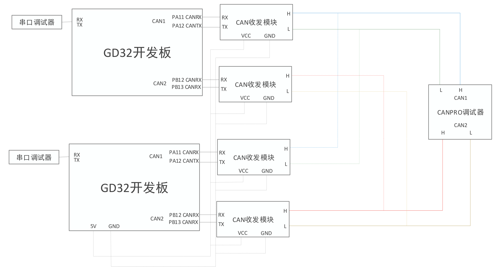
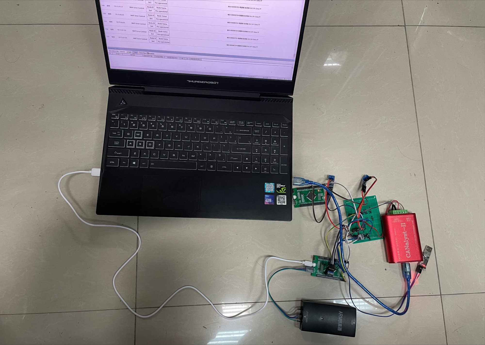
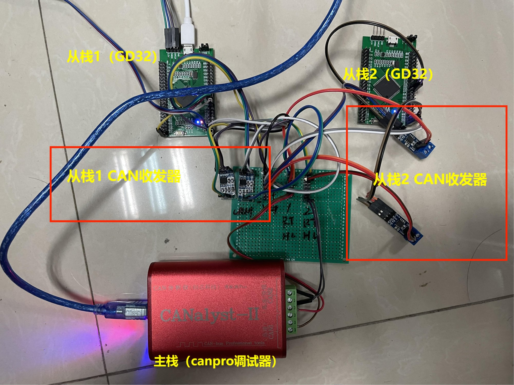

# canopen_rtt_gd32

使用两个GD32F4开发板外挂CAN收发器作为从栈，使用CANPRO调试器作为主栈。

该仓库主要用作canopen协议栈的开发测试

### 系统结构

### 项目总览

### 详细标注

### 从栈代码说明

#### 打开代码

使用rtthread studio 软件 打开 具体下载使用参考官方文档
https://www.rt-thread.org/document/site/rtthread-studio/nav/

#### 代码阅读

所有CANOPEN相关功能均在
项目目录/stm32f407vet6-canopen\applications\CanFestival-rtt-fix\src\states.c   文件   66行 void canDispatch(CO_Data* d, Message *m) 函数中
包括 SYNC同步，时间戳，等其他所有功能的实现

#### 字典文件

项目目录\stm32f407vet6-canopen\applications\CanFestival-rtt-fix\examples\SillySlave\SillySlave.c 文件中
请自行阅读

### 项目说明

1、使用两个GD32F4开发板外挂CAN收发器作为从栈，使用CANPRO调试器作为主栈。
2、项目实现了 心跳协议、PDO通信对象（报文）、SYNC同步对象（报文）、TIME时间戳对象。
3、AD采集部分，可在视频中见到，主栈每10ms发送同步报文，从栈每接收到10个同步报文就会上传一次AD数据。
4、IO输出部分，可见，在视频中发送PDO，可以控制从栈（开发板）的IO口输出。